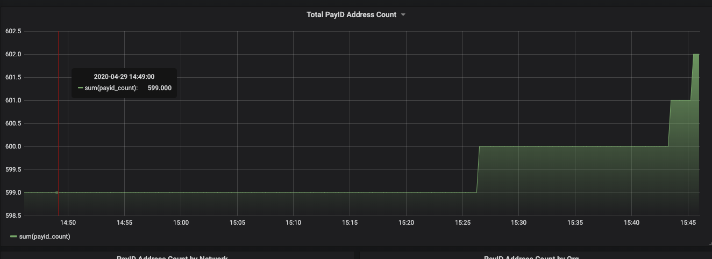
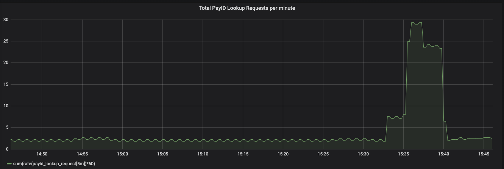
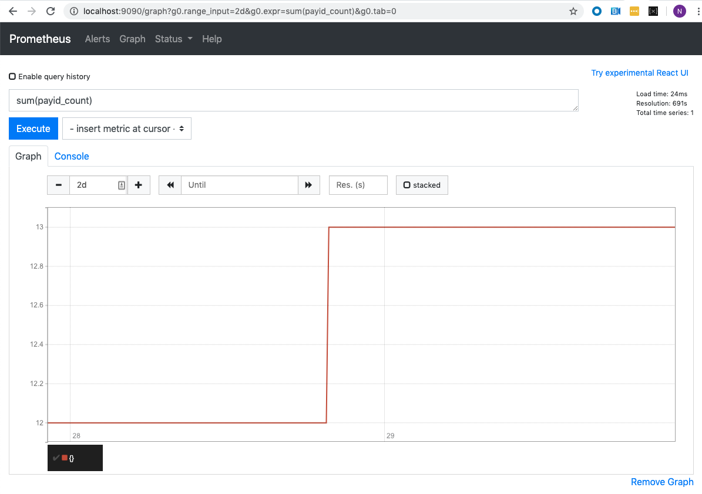

# Obtain and Analyze PayID Metrics With Prometheus and Grafana

To use PayID, you deploy a PayID server. A PayID server automatically collects metrics. This tutorial describes how to import these metrics into [Prometheus](https://prometheus.io/) and analyze them with [Grafana](https://grafana.com/).

## Available metrics

The PayID server captures these metrics:

- `payid_count` - Number of PayID address mappings in the system. This is calculated periodically by query the PayID database and published as metrics periodically (every 60s by default). In Prometheus terms, this metric is a gauge. This metric has the following attributes:
  - `paymentNetwork` - The payment network for the PayID address mapping, such as XRPL, BTC, ACH, and so on)
  - `environment` - The payment network’s environment for the PayID address mapping (e.g. testnet, mainnet, rinkby, and so on)
- `payid_lookup_request` - Number of PayID lookup requests. This metric is updated every time a PayID server is called to look up the address mappings for a PayID. In Prometheus terms, this metric is a counter. This metric has the following attributes:
  - paymentNetwork - same meaning as above for payid_count
  - environment - same meaning as above for payid_count
  - result - the result of the lookup. Possible values include:
    - `found` - an address was found for the PayID lookup
    - `not_found` - as address was not found for the PayID lookup
    - `error` - there was an error in the PayID lookup request. For example, if the client provided an Accept that was invalid or missing.

This data can be used to generate real-time charts. For example, this chart shows how many PayID address mappings exist in the system over time.


This chart shows the rate per minute of PayID lookup requests.


## Import metrics from PayID server to Prometheus

You can use a push or pull method to obtain metrics from Prometheus.

### How to pull metrics to Prometheus

Prometheus pulls metrics by scraping a known endpoint for metrics data. The PayID server exposes metrics in Prometheus format on the admin port (default 8081). For simplicity, you can configure Prometheus to scrape metrics directly from the PayID server. Prometheus must be running inside the same network as PayID server because Prometheus needs access to the admin port. If multiple instances of PayID server are being run behind a load balancer, then Prometheus must pull metrics directly from each instance, not through the load balancer. This direct method is recommended for collecting metrics using your own Prometheus server.

Here is a sample `prometheus.yml` configuration file set up to pull metrics from a PayID server running locally.

```
# my global config
global:
  scrape_interval:     5s # Set the scrape interval to every 15 seconds. Default is every 1 minute.
  evaluation_interval: 5s # Evaluate rules every 15 seconds. The default is every 1 minute.
  # scrape_timeout is set to the global default (10s).

# A scrape configuration containing exactly one endpoint to scrape:
# Here it's Prometheus itself.
scrape_configs:
  # The job name is added as a label `job=<job_name>` to any timeseries scraped from this config.
  - job_name: 'prometheus'
    honor_labels: true
    # metrics_path defaults to '/metrics'
    # scheme defaults to 'http'.

    static_configs:
    - targets: ['localhost:8081']
```

### How to push metrics from the PayID server to Prometheus

Alternatively, you can push metrics from the PayID server to Prometheus using a [pushgateway](https://github.com/prometheus/pushgateway). This setup requires running a pushgateway in addition to a Prometheus server, and configuring the PayID server to push metrics to the pushgateway. Prometheus then pulls metrics from the pushgateway. In this setup, Prometheus and pushgateway do not need to run inside the same network as the PayID server(s), but the PayID server must be able to reach the pushgateway over http. This is the recommended method for pushing metrics to a third party such as Xpring.

By default, PayID server does not push metrics to a pushgateway. To push metrics, follow this procedure:

1. Set the environment variables `PUSH_GATEWAY_URL` with the url to your pushgateway and `PAYID_ORG` to the name of your organization.
2. Restart your PayID server.

For example, if the fictitious company Vandelay Industries wants to push metrics to a pushgateway running at `https://some-pushgateway.com`, then set these environment variables: `PUSH_GATEWAY_URL= https://some-pushgateway.com` and `PAYID_ORG='Vandelay Industries'`.

By default, a PayID server will push metrics every 15 seconds to the configured pushgateway. To change this frequency, set the `PUSH_METRICS_INTERVAL` value. For example, to push every 5 minutes (300 seconds), set `PUSH_METRICS_INTERVAL=300`. This value must be a positive number.

### Use push and pull methods together

Both push and pull methods can be used together, for example, to pull metrics into an internal Prometheus server and push metrics to a third-party Prometheus server.

## Visualize metrics with Prometheus and Grafana

Prometheus has an admin web console with limited visualization capabilities on port 9090 (default), as shown in this example.



To build dashboards with multiple charts, you can [use Grafana and configure Prometheus as a datasource](https://prometheus.io/docs/visualization/grafana/).

## Tutorial--Deploy a PayID server with Docker, and pull PayID metrics into Prometheus

In this tutorial, you will deploy a PayID server and run Prometheus locally using Docker, and you will create a configuration file for the PayID server so that PayID metrics are pulled into Prometheus.

### Prerequisites

Install the following software on your machine, if not already present.

- [npm](https://docs.npmjs.com/cli/install)
- [docker](https://docs.docker.com/get-docker/)
- [git](https://git-scm.com/book/en/v2/Getting-Started-Installing-Git)

### Build a Docker container for setting up a PayID server

Run these commands to build a Docker container for a PayID server.

```
git clone git@github.com:xpring-eng/payid.git
cd payid
docker build -t payid-server .
```

### Create Docker network for PayID

You will run several containers in Docker that must talk to each other. To set up these containers, create a docker network called `payid-network`.

```
docker network create payid-network
```

### Start a Postgres Database

To have a PayID server, you require a Postgres database to store PayID accounts and address mappings. To do this, run the postgres database in docker with a default password of `password`, and tell the database to use the `payid-network` that you previously created. Name this docker container `payid-postgres`, so that you can reference the container by name when you connect your PayID server. Note that both the default database and the user are named `postgres`, as described at [Postgres Docker Official Images](https://hub.docker.com/_/postgres).

```
docker run -d --rm --name payid-postgres --network payid-network -e POSTGRES_PASSWORD=password postgres
```

### Start and test the PayID server

To start the PayID server, run the PayID server in docker using the image you created. You must also use the docker network `payid-network` so that it can connect to the `payid-postgres` container.

```
docker run -it -p 8080:8080 -p 8081:8081 --name payid-server --network payid-network -e DB_PASSWORD=password -e DB_NAME=postgres -e DB_HOSTNAME=payid-postgres payid-server
```

Test whether the PayID server is running by creating a PayID with this cURL command.

```
 curl --location --request POST 'http://127.0.0.1:8081/users' --header 'PayID-API-Version: 2020-06-10' --header 'Content-Type: application/json' --header 'Content-Type: text/plain' --data-raw '{
     "payId": "alice$127.0.0.1",
     "addresses": [
         {
             "paymentNetwork": "XRPL",
             "environment": "TESTNET",
             "details": {
                 "address": "TVacixsWrqyWCr98eTYP7FSzE9NwupESR4TrnijN7fccNiS"
             }
         }
     ]
 }'
```

You should get a `Created` response.

Query the PayID server to make sure it resolves, using this cURL command.

`curl http://127.0.0.1:8080/alice -H "Accept: application/xrpl-testnet+json"`

### Start Prometheus

In this step, you will run prometheus in docker and configure it to scrape the PayID server’s metrics. To do this, you need to create a `prometheus.yml` file on the host machine and mount it in the docker container.

Create a file named `prometheus.yml` with these contents.

```
 global:
   scrape_interval:     15s # Set the scrape interval to every 15 seconds. Default is every 1 minute.
   evaluation_interval: 15s # Evaluate rules every 15 seconds. The default is every 1 minute.

 scrape_configs:
   - job_name: 'payid-metric'
     honor_labels: true
     static_configs:
     - targets: ['payid-server:8081']
```

Start the docker container:

`docker run -d --network payid-network -p 9090:9090 -v $PWD/prometheus.yml:/etc/prometheus/prometheus.yml prom/prometheus`

You can verify Prometheus is running by opening `http://localhost:9090/graph` in a browser.

You can verify metrics collection metrics are being collected by entering the following expression into the form:

`sum(payid_count)`

Click `Execute`. If successful, the results look like this:


Click the **Graph** tab to display the results in graph format.

Here are some other example expressions:

- `sum(payid_count) by (paymentNetwork)` - Sum of `payid` count by payment network, such as XRPL, BTC, and so forth.
- `sum(payid_lookup_request)` - Total number of `payid` lookup requests.
- `rate(payid_lookup_request[5m])` - Rate of `payid` lookup requests per second.
