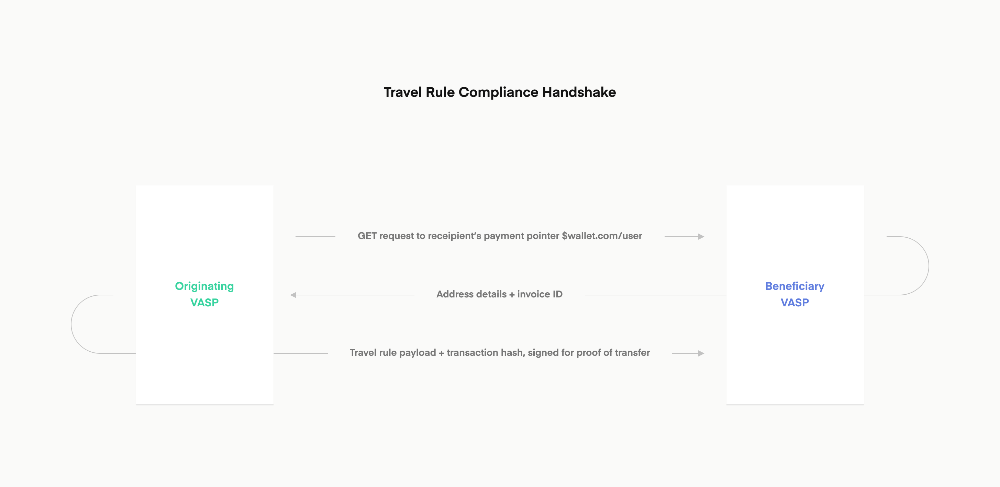
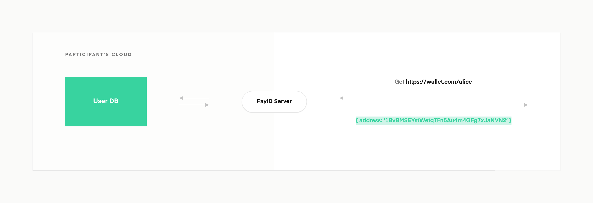

# PayID: A Protocol for Human-Readable, Travel-Rule-Compliant Addresses <!-- omit in toc -->

You can also view the PayID documentation at [docs.payid.org](https://docs.payid.org).

With PayID, you can use human-readable addresses to transmit value in the currency of your choice. The PayID network allows participants to reach one another through a standardized address. For example, `alice$wallet.com` maps to the corresponding URL `https://wallet.com/alice`.

When you make an HTTP GET request that follows the PayID protocol, it resolves to an address on the underlying payment network. PayID is a payment-network-agnostic protocol, capable of sending payments in BTC, ETH, XRP, or fiat networks like ACH.

Each request must have a valid `Accept` request HTTP header. For example: `Accept: application/xrpl-mainnet+json` indicates the XRP Ledger Mainnet payment network and the JSON format of the response payload.

PayID is fully peer-to-peer with no central counterparty. Anyone can set up their own PayID server or integrate with a trustless blockchain solution so they have no counterparty risk.

The PayID protocol is designed to be simple, general, open, and universal. This makes it composable with any other existing namespace, including blockchain namespace projects like ENS and Unstoppable Domains or app-specific usernames. Anyone with an existing username or address can get a PayID address that works across all platforms.

# Table of Contents <!-- omit in toc -->

- [1. Web standards](#1-web-standards)
  - [1a. Decentralized and trust-minimized](#1a-decentralized-and-trust-minimized)
  - [1b. Protocol abstraction](#1b-protocol-abstraction)
- [2. Extensions and Travel Rule compliance](#2-extensions-and-travel-rule-compliance)
- [3. Future features and integrations](#3-future-features-and-integrations)
- [4. PayID integration and the PayID APIs](#4-payid-integration-and-the-payid-apis)
  - [4.1. Set up a PayID server for demonstration purposes](#41-set-up-a-payid-server-for-demonstration-purposes)
  - [4.2. Private API endpoints](#42-private-api-endpoints)
    - [4.2.1. Get a PayID user information](#421-get-a-payid-user-information)
    - [4.2.2. Create a PayID user](#422-create-a-payid-user)
    - [4.2.3. Update a PayID user](#423-update-a-payid-user)
    - [4.2.4. Delete a PayID user](#424-delete-a-payid-user)
  - [4.3. Public API endpoints](#43-public-api-endpoints)
    - [4.3.1. Get a Travel Rule compliance invoice](#431-get-a-travel-rule-compliance-invoice)
    - [4.3.2. Send compliance information](#432-send-compliance-information)
    - [4.3.3. Send payment proof](#433-send-payment-proof)
    - [4.3.4. Get user information](#434-get-user-information)
- [5. Schemas](#5-schemas)
  - [5.1 Example single user schema](#51-example-single-user-schema)
  - [5.2 Example error schema](#52-example-error-schema)
  - [5.3. Example invoice schema](#53-example-invoice-schema)
  - [5.4. Example compliance message schema](#54-example-compliance-message-schema)
  - [5.5. Request headers](#55-request-headers)
- [6. Code examples](#6-code-examples)
  - [6.1 Payment](#61-payment)
  - [6.2 Generate a seed-based wallet](#62-generate-a-seed-based-wallet)
- [7. Interfaces](#7-interfaces)
  - [7.1. PaymentInformation type](#71-paymentinformation-type)
  - [7.2. CryptoAddressDetails](#72-cryptoaddressdetails)
  - [7.3. AchAddressDetails](#73-achaddressdetails)
  - [7.4. Error](#74-error)
- [8. Use Xpring SDK with PayID](#8-use-xpring-sdk-with-payid)
  - [8.1. Demo](#81-demo)
- [9. Headers for GET requests for PayID Public API](#9-headers-for-get-requests-for-payid-public-api)
  - [9.1. Headers for XRP](#91-headers-for-xrp)
  - [9.2. Headers for ACH](#92-headers-for-ach)
  - [9.3. Headers for BTC](#93-headers-for-btc)
  - [9.4. Headers for ETH](#94-headers-for-eth)

## 1. Web standards

PayID uses existing web standards and infrastructure, including HTTP and DNS. Each institution supports its users through its domain, creating a decentralized network where institutions maintain sovereignty over their own users. Each institution is empowered to participate in the network by deploying its own server with its own users. Additionally, a user who prefers to self-custody their cryptocurrency can deploy a personal PayID server, as described in [Set up a PayID server](#set-up-a-payid-server).

PayID does not rely on any consensus protocols, which simplifies infrastructure demands.

### 1a. Decentralized and trust-minimized

PayID is built on the most successful decentralized network in history: the web. PayID is fully peer-to-peer with no central counterparty. Anyone can set up their own personal PayID server so they have no counterparty risk.

### 1b. Protocol abstraction

PayID fully abstracts away underlying payment rail details from end users. A user only needs to keep track of a single PayID rather than a complex address for each network. Service operators can manage the underlying addresses behind the scenes according to their own security and privacy best practices without requiring the end user to take any action.

## 2. Extensions and Travel Rule compliance

PayID is an extensible and flexible open standard. PayID can be extended to provide a simple solution for [Travel Rule](https://www.fatf-gafi.org/media/fatf/documents/recommendations/RBA-VA-VASPs.pdf) compliance, a relevant capability for many crypto services. Financial institutions can communicate regulatory requirements and the corresponding necessary data by using the PayID Public API, which is a standard REST API.

PayID improves the user experience of sending cryptocurrency payments, and it also provides a platform for present-day features like Travel Rule compliance and future features like subscriptions and pull payments. To achieve mainstream cryptocurrency adoption, we must build on top of PayID and other systems that integrate well with traditional financial infrastructure.

PayID provides an abstraction layer so that users can send payments to human-readable addresses while virtual asset service providers (VASPs) can meet the necessary compliance requirements in the background.

**Coming soon:** When a payment is sent to a PayID address, then if both entities are VASPs and must comply with the Travel Rule, they will exchange the user data in a secure handshake.



## 3. Future features and integrations

Features and integrations on the roadmap include:

- Additional payment rail standards
- Payment request ([W3C Standard](https://www.w3.org/TR/payment-request/)) integration
- Advanced payment type support: pull, push, streaming, subscription
- PayID forwarding and redirection

## 4. PayID integration and the PayID APIs

You can deploy your own PayID server and then create PayIDs for your users using the PayID Private API. You can also query and modify this list of users. This API should be exposed internally only, so that only your company's systems can update PayID mappings.

Once you have set up a PayID server, anyone can use the PayID Public API to query address information. This API is publicly accessible so that anyone can send payments to your users' PayID addresses.

### 4.1. Set up a PayID server for demonstration purposes

Participating institutions can use Xpring’s open source reference implementation of the PayID server. You might be able to ease the deployment process by connecting your PayID server to your existing user database so that it can respond to incoming GET requests.

To set up your own demo server, first ensure you have Docker installed, and then run these commands. You will create a local docker image.

```sh
git clone git@github.com:xpring-eng/payid.git
cd payid
./demo/run_payid_demo.sh
```

You can then use the Private PayID API to:

- Create a user
- Get user information
- Modify a user
- Delete a user



### 4.2. Private API endpoints

The private APIs run by default on port 8081. Make sure to adjust this value if needed.
The list of private endpoints is:

| HTTP Method                              | Endpoint                 |                     Description |
| ---------------------------------------- | :----------------------- | ------------------------------: |
| [GET](#421-get-a-payid-user-information) | /v1/users/{user}\${host} |    Get a PayID user information |
| [POST](#422-create-a-payid-user)         | /v1/users                |             Create a PayID user |
| [PUT](#423-update-a-payid-user)          | /v1/users/{user}\${host} | Update a PayID user information |
| [DELETE](#424-delete-a-payid-user)       | /v1/users/{user}\${host} |             Delete a PayID user |

Once you have set up your PayID server, you can access the Private PayID API endpoints using Postman or these cURL commands.

#### 4.2.1. Get a PayID user information

**Request format**

```
GET {pay_id_base_url}/v1/users/{user}${host}
```

**Path parameters (Required)**

| Parameter | Type   |                                    Description |
| --------- | :----- | ---------------------------------------------: |
| {user}    | string |                          User account in PayID |
| {host}    | string | Host domain name identifying your organization |

**Query parameters (None)**

This method does not accept any query parameters.

**Body parameters (None)**

This method does not accept any body parameters.

### Response format <!-- omit in toc -->

A successful response to the "Get PayID user information" method returns a 200 HTTP status code.

### Example <!-- omit in toc -->

This operation creates a single user.

**Success**

Request (Success)

```HTTP
GET http://127.0.0.1:8081/v1/users/bob$127.0.0.1 HTTP/1.1
```

Response (Success)

```json
{
  "payId": "bob$127.0.0.1",
  "addresses": [
    {
      "paymentNetwork": "XRPL",
      "environment": "TESTNET",
      "details": {
        "address": "TVnGpXXZZ3xAZfhT42ntuCR4Uh3Rv9LE4BcZJeH1zds2CQ1"
      }
    }
  ]
}
```

### Status code and Messages <!-- omit in toc -->

The following table lists the HTTP status codes and messages returned for this method.

| HTTP Status code |                                Description |
| ---------------- | -----------------------------------------: |
| 200              | Successfully retrieved a PayID information |
| 404              |                PayID information not found |

#### 4.2.2. Create a PayID user

**Request format**

```
POST {pay_id_base_url}/v1/users
```

**Path parameters (None)**

The Create User method does not accept parameters in the endpoint's request path.

**Query parameters (None)**

The "Create a PayID user" method does not accept any query parameters.

**Body parameters (Required)**

Create PayID user requires the body parameter that contains the `PaymentInformation` object.

**PaymentInformation Object Data Fields**

| Field     | Type   |                                                                       Description |
| --------- | :----- | --------------------------------------------------------------------------------: |
| payId     | string | String containing the PayID user name and the host (FQDN) separated by a `$` sign |
| addresses | array  |                                 List of addresses associated with your PayID user |
| memo      | string |              optional string field to include meta data surrounding a transaction |

**Addresses Array Data Fields**

| Field          | Type   |                                                                                                            Description |
| -------------- | :----- | ---------------------------------------------------------------------------------------------------------------------: |
| paymentNetwork | string |                                                         A payment network, like the bitcoin network, the XRPL, or ACH. |
| environment    | string | "Environment" of the payment network for this payment address. For example, the XPRL has MAINNET, TESTNET, and DEVNET. |
| details        | Object |                                                                      JSON object containing the network wallet details |

**Details Object Data Fields**

| Field   | Type   |                                    Description |
| ------- | :----- | ---------------------------------------------: |
| address | string |                         Network wallet address |
| tag     | string | (May be omitted) Tag for XRP classic addresses |

### Response format <!-- omit in toc -->

A successful response to the "Create PayID user" method returns a 201 HTTP status code.

### Example <!-- omit in toc -->

**Success**

Request (Success)

The addresses array can contain 1 or more objects.

```HTTP
POST http://127.0.0.1:8081/v1/users HTTP/1.1

{
  "payId": "bob$127.0.0.1",
  "addresses": [
    {
      "paymentNetwork": "XRPL",
      "environment": "TESTNET",
      "details": {
        "address": "TVnGpXXZZ3xAZfhT42ntuCR4Uh3Rv9LE4BcZJeH1zds2CQ1"
      }
    },
    {
      "paymentNetwork": "XRPL",
      "environment": "MAINNET",
      "details": {
        "address": "X7zmKiqEhMznSXgj9cirEnD5sWo3iZSbeFRexSFN1xZ8Ktn"
      }
    }
  ]
}
```

Response (Success)

```
Created
```

### Status code and Messages <!-- omit in toc -->

The following table lists the HTTP status codes and messages returned for this method.

| HTTP Status code |                                                                    Description |
| ---------------- | -----------------------------------------------------------------------------: |
| 201              |                                       Successfully created a PayID information |
| 409              | Conflict, it already exists a user with the PayID specified in the payId field |
| 500              |                          Internal server error. A body field might be missing. |

#### 4.2.3. Update a PayID user

You can modify the user information associated with a particular PayID address.

**Request format**

```
PUT {pay_id_base_url}/v1/users/{user}${host}
```

**Path parameters (Required)**

| Parameter | Type   |                             Description |
| --------- | :----- | --------------------------------------: |
| {user}    | string |                   User account in PayID |
| {host}    | string | Host name identifying your organization |

**Query parameters (None)**

This method does not accept any query parameters.

**Body parameters (Required)**

Update a PayID user requires the body parameter that contains the `PaymentInformation Object` object.

**PaymentInformation Data Fields**

| Field     | Type   |                                                                       Description |
| --------- | :----- | --------------------------------------------------------------------------------: |
| payId     | string | String containing the PayID user name and the host (FQDN) separated by a `$` sign |
| addresses | array  |                                 List of addresses associated with your PayID user |
| memo      | string |              optional string field to include meta data surrounding a transaction |

**Addresses Array Data Fields**

| Field          | Type   |                                                                                                            Description |
| -------------- | :----- | ---------------------------------------------------------------------------------------------------------------------: |
| paymentNetwork | string |                                                         A payment network, like the bitcoin network, the XRPL, or ACH. |
| environment    | string | "Environment" of the payment network for this payment address. For example, the XPRL has MAINNET, TESTNET, and DEVNET. |
| details        | Object |                                                                      JSON object containing the network wallet details |

**Details Object Data Fields**

| Field   | Type   |                                                                                                    Description |
| ------- | :----- | -------------------------------------------------------------------------------------------------------------: |
| address | string | Actual payment information for this address. Must be in the form `CryptoAddressDetails` or `AchAddressDetails` |

### Response format <!-- omit in toc -->

A successful response to the "Update a PayID user" method returns a 201 HTTP status code.

### Example <!-- omit in toc -->

**Success**

Request (Success)

```HTTP
PUT http://127.0.0.1:8081/v1/users/bob$127.0.0.1 HTTP/1.1

{
	"payId": "bob$127.0.0.1",
	"addresses": [
		{
			"paymentNetwork": "XRPL",
			"environment": "TESTNET",
			"details": {
			  "address": "TVnGpXXZZ3xAZfhT42ntuCR4Uh3Rv9LE4BcZJeH1zds2CQ2"
			}
		}
	]
}
```

Response (Success)

```
Created
```

### Status code and Messages <!-- omit in toc -->

The following table lists the HTTP status codes and messages returned for this method.

| HTTP Status code |                                                                    Description |
| ---------------- | -----------------------------------------------------------------------------: |
| 200              |                                  Successfully updated a PayID user information |
| 400              |                                                                    Bad request |
| 404              |                                                                      Not found |
| 409              | Conflict. it already exists a user with the PayID specified in the payId field |
| 500              |                          Internal server error. A body field might be missing. |
| 503              |                                                            Service unavailable |

#### 4.2.4. Delete a PayID user

**Request format**

```
DELETE {pay_id_base_url}/v1/users/{user}${host}
```

**Path parameters (Required)**

| Parameter | Type   |                             Description |
| --------- | :----- | --------------------------------------: |
| {user}    | string |                   User account in PayID |
| {host}    | string | Host name identifying your organization |

**Query parameters (None)**

This method does not accept any query parameters.

**Body parameters (Required)**

The "Delete a PayID user" does not require a body parameter.

### Response format <!-- omit in toc -->

A successful response to the "Delete a PayID user" method returns a 204 HTTP status code.

### Example <!-- omit in toc -->

**Success**

Request (Success)

```HTTP
DELETE http://127.0.0.1:8081/v1/users/bob$127.0.0.1 HTTP/1.1

{
	"payId": "bob$127.0.0.1",
	"addresses": [
		{
			"paymentNetwork": "XRPL",
			"environment": "TESTNET",
			"details": {
			  "address": "TVnGpXXZZ3xAZfhT42ntuCR4Uh3Rv9LE4BcZJeH1zds2CQ2"
			}
		}
	]
}
```

Response (Success)

```
Empty 204 response
```

### Status code and Messages <!-- omit in toc -->

The following table lists the HTTP status codes and messages returned for this method.

| HTTP Status code |                                 Description |
| ---------------- | ------------------------------------------: |
| 204              | Represents a successful PayID user deletion |
| 400              |                                 Bad request |
| 404              |                                   Not found |
| 503              |                         Service unavailable |

### 4.3. Public API endpoints

The public APIs runs by default on port 8080. Make sure to update this value if needed.
The list of public endpoints is:

| HTTP Method                                      | Endpoint                     |                          Description |
| ------------------------------------------------ | :--------------------------- | -----------------------------------: |
| [GET](#431-get-a-travel-rule-compliance-invoice) | /{user}/invoice?nonce=<uuid> | Get a Travel Rule compliance invoice |
| [POST](#432-send-compliance-information)         | /{user}/invoice?nonce=<uuid> |          Send compliance information |
| [POST](#433-send-payment-proof)                  | /{user}/payment-proof        |                   Send payment proof |
| [GET](#434-get-user-information)                 | /{user}                      |         Get a PayID user information |

#### 4.3.1. Get a Travel Rule compliance invoice

**Description**

In a typical scenario that involves Travel Rule compliance, you, as the sender of the payment, first request an invoice. When you get the invoice, you notice the `complianceRequirements` field of the invoice, which any institution that is a VASP (Virtual Asset Service Provider) must adhere to. Because you originated the invoice, you then post the compliance data to the same URL to update the invoice with this compliance information, thus fulfilling the requirements of the Travel Rule. The beneficiary confirms that you have sent this information by sending an upgraded invoice.

**API**
The API returns an invoice for the specified user and nonce.
The nonce used in this call is a [UUID](https://en.wikipedia.org/wiki/Universally_unique_identifier).

**Request format**

```HTTP
GET {pay_id_base_url}/{user}/invoice?nonce=<uuid> HTTP/1.1

Accept: application/{paymentNetwork}-{environment}+json
Content-Type: application/json
```

**Path parameters (Required)**

| Parameter | Type   |           Description |
| --------- | :----- | --------------------: |
| user      | string | User account in PayID |

**Query parameters (None)**

The "Get Invoice" method accepts the required query parameter described in the following table:

| Parameter | Type |                                                                                                                                      Description |
| --------- | :--- | -----------------------------------------------------------------------------------------------------------------------------------------------: |
| nonce     | UUID | Unique [UUID](https://en.wikipedia.org/wiki/Universally_unique_identifier). Can be generated [here](https://www.uuidgenerator.net/) for example. |

**Headers parameters (Required)**

PayID is a fundamentally neutral protocol. When you make a request, the HTTP `Accept` header of the request specifies the payment network and environment, and PayID is therefore capable of returning a user's address information for any network in which that user participates.

Please, follow this [link](#9-headers-for-get-requests-for-payid-public-api) to see the Accept headers compatible with PayID.

**Body parameters (Required)**

Update a PayID user requires the body parameter that contains the `Update PayID User Object` object.

### Response format <!-- omit in toc -->

A successful response to the "Get invoice" method returns a 200 HTTP status code.

### Example <!-- omit in toc -->

**Success**

Request (Success)

```HTTP
GET https://sender.institution.com/bob/invoice?nonce=8743e9ba-ee96-4ec0-b388-6df3fd3a7c64 HTTP/1.1

Accept: application/xrpl-testnet+json
Content-Type: application/json
```

Response (Success)

```json
{
  "messageType": "Invoice",
  "message": {
    "nonce": "8743e9ba-ee96-4ec0-b388-6df3fd3a7c64",
    "expirationTime": 1588502198568,
    "paymentInformation": {
      "addressDetailType": "CryptoAddressDetails",
      "addressDetails": {
        "address": "TVnGpXXZZ3xAZfhT42ntuCR4Uh3Rv9LE4BcZJeH1zds2CQ1"
      },
      "payId": "bob$127.0.0.1",
      "memo": "this is bob's XRP testnet address"
    },
    "complianceRequirements": ["TravelRule"],
    "complianceHashes": []
  },
  "publicKeyType": "x509+sha256",
  "publicKeyData": [],
  "publicKey": "00:c9:22:69:31:8a:d6:6c:ea:da:c3:7f:2c:ac:a5:af:c0:02:ea:81:cb:65:b9:fd:0c:6d:46:5b:c9:1e:9d:3b:ef",
  "signature": "8b:c3:ed:d1:9d:39:6f:af:40:72:bd:1e:18:5e:30:54:23:35..."
}
```

### Status code and Messages <!-- omit in toc -->

The following table lists the HTTP status codes and messages returned for this method.

| HTTP Status code |                    Description |
| ---------------- | -----------------------------: |
| 200              | Invoice successfully retrieved |
| 400              |                    Bad request |
| 404              |                      Not found |
| 503              |            Service unavailable |

#### 4.3.2. Send compliance information

If an invoice contains information in the `complianceRequirements` field, then upon receipt of the invoice, the sender institution must send back compliance information.

**Request format**

```HTTP
POST {pay_id_base_url}/{user}/invoice?nonce=<uuid> HTTP/1.1

Content-Type: application/json
```

**Path parameters (Required)**

| Parameter | Type   |           Description |
| --------- | :----- | --------------------: |
| user      | string | User account in PayID |

**Query parameters (None)**

The "Get Invoice" method accepts the required query parameter described in the following table:

| Parameter | Type |                                                                                                                                                      Description |
| --------- | :--- | ---------------------------------------------------------------------------------------------------------------------------------------------------------------: |
| nonce     | UUID | Unique [UUID](https://en.wikipedia.org/wiki/Universally_unique_identifier). `IMPORTANT:` The value must be the same as the one returned by the "GET invoice" API |

**Body parameters (Required)**

"Send compliance information" requires the body parameter that contains the `Compliance Message Object` object.

### Response format <!-- omit in toc -->

A successful response to the "Get invoice" method returns a 200 HTTP status code.

### Example <!-- omit in toc -->

**Success**

Request (Success)

The body contains the [compliance message](#example-compliance-message-schema). This message contains information about the originator, the value of the transaction, and the beneficiary, and the message is signed cryptographically.

```HTTP
POST https://sender.institution.com/bob/invoice?nonce=8743e9ba-ee96-4ec0-b388-6df3fd3a7c64 HTTP/1.1

{
	"messageType": "compliance",
		"message": {
			"type": "TravelRule",
			"data": {
				"originator": {
				"userLegalName": "Theodore Kalaw",
				"accountId": "ef841530-f476-429c-b8f3-de25a0a29f80 ",
				"userPhysicalAddress": "520 Main Street",
				"institutionName": "xpring",
				"value": {
					"amount": "100",
					"scale": 1
				},
			"timestamp": "1586361979654"
			},
			"beneficiary": {
				"institutionName": "xpring"
			}
                        "memo": "transaction by Theodore Kalaw for software development services",

		}
	},
	"publicKeyType": "x509+sha256",
    "publicKeyData": [],
    "publicKey": "00:c9:22:69:31:8a:d6:6c:ea:da:c3:7f:2c:ac:a5:af:c0:02:ea:81:cb:65:b9:fd:0c:6d:46:5b:c9:1e:9d:3b:ef",
    "signature": "8b:c3:ed:d1:9d:39:6f:af:40:72:bd:1e:18:5e:30:54:23:35..."
}
```

Response (Success)

```json
{
  "messageType": "Invoice",
  "message": {
    "nonce": "123456",
    "expirationTime": 1584753369,
    "paymentInformation": {
      "addressDetailType": "CryptoAddressDetails",
      "addressDetails": {
        "address": "T71Qcu6Txyi5y4aa6ZaVBD3aKC4oCbQTBQr3QfmJBywhnwm"
      },
      "proofOfControlSignature": "9743b52063cd84097a65d1633f5c74f5",
      "payId": "alice$xpring.money",
      "memo": "this is alice's XRP testnet address"
    },
    "complianceRequirements": ["TravelRule"],
    "memo": "thanks for travel rule data, here is your new invoice",
    "complianceHashes": [
      {
        "type": "TravelRule",
        "hash": "8743b52063cd84097a65d1633f5c74f5"
      }
    ]
  },
  "publicKeyType": "x509+sha256",
  "publicKeyData": [],
  "publicKey": "00:c9:22:69:31:8a:d6:6c:ea:da:c3:7f:2c:ac:a5:af:c0:02:ea:81:cb:65:b9:fd:0c:6d:46:5b:c9:1e:9d:3b:ef",
  "signature": "8b:c3:ed:d1:9d:39:6f:af:40:72:bd:1e:18:5e:30:54:23:35..."
}
```

### Status code and Messages <!-- omit in toc -->

The following table lists the HTTP status codes and messages returned for this method.

| HTTP Status code |          Description |
| ---------------- | -------------------: |
| 200              |                   OK |
| 400              |          Bad request |
| 404              |            Not found |
| 422              | Unprocessable Entity |
| 503              |  Service unavailable |

#### 4.3.3. Send payment proof

The originator of the transaction sends a payment proof after the payment clears and settles.

**Request format**

```HTTP
POST {pay_id_base_url}/{user}/payment-proofs HTTP/1.1

Content-Type: application/json
```

**Path parameters (Required)**

| Parameter | Type   |           Description |
| --------- | :----- | --------------------: |
| user      | string | User account in PayID |

**Query parameters (None)**

The "Send payment proof" method does not accept any query parameters.

**Body parameters (Required)**

"Send payment proof" requires the body parameter that contains the `Send payment proof Object` object.

**Send payment proof Object Data Fields**

| Field                   | Type   |       Description |
| ----------------------- | :----- | ----------------: |
| invoiceHash             | string |      Invoice hash |
| transactionConfirmation | UUID   |    Transaction ID |
| memo                    | string | Optional metadata |

### Response format <!-- omit in toc -->

A successful response to the "Send payment proof" method returns a 200 HTTP status code.

### Example <!-- omit in toc -->

**Success**

Request (Success)

```HTTP
POST https://sender.institution.com/bob/payment-proofs HTTP/1.1

{
	"invoiceHash": "8743b52063cd84097a65d1633f5c74f5",
	"transactionConfirmation": "797A887A269FEAFFEC446389DC1BB8C0DFBF9421C2FA72CA244AA5EB027008FC"
}
```

Response (Success)

```
200 OK
```

#### 4.3.4. Get user information

The PayID Public API does not require authentication, as it is open to any user. The PayID Private API is meant for administrators who are building a payment network.

**Request format**

```HTTP
GET {pay_id_base_url}/{user} HTTP/1.1

Accept: application/{paymentNetwork}-{environment}+json
```

**Path parameters (Required)**

| Parameter | Type   |           Description |
| --------- | :----- | --------------------: |
| user      | string | User account in PayID |

**Query parameters (None)**

The "Send payment proofs" method does not accept any query parameters.

**Headers parameters (Required)**

PayID is a fundamentally neutral protocol. When you make a request, the HTTP `Accept` header of the request specifies the payment network and environment, and PayID is therefore capable of returning a user's address information for any network in which that user participates.

Please, follow this [link](#9-headers-for-get-requests-for-payid-public-api) to see the Accept headers compatible with PayID.

**Body parameters (Required)**

"Get user" does not require a body.

### Example <!-- omit in toc -->

**Success**

Request (Success)

```HTTP
GET http://127.0.0.1/bob HTTP/1.1

Accept: application/xrpl-testnet+json
```

Response (Success)

A [PaymentInformation](#71-paymentinformation-type) PaymentInformation type) object is returned.

```json
{
  "addressDetailType": "CryptoAddressDetails",
  "addressDetails": {
    "address": "TVnGpXXZZ3xAZfhT42ntuCR4Uh3Rv9LE4BcZJeH1zds2CQ1"
  },
  "memo": "this is an XRP testnet address"
}
```

### Status code and Messages <!-- omit in toc -->

The following table lists the HTTP status codes and messages returned for this method.

| HTTP Status code |         Description |
| ---------------- | ------------------: |
| 200              |                  OK |
| 400              |         Bad request |
| 404              |           Not found |
| 503              | Service unavailable |

## 5. Schemas

These schemas are used for request or response payloads for various requests.

### 5.1 Example single user schema

A single user can have multiple destinations, because the same user can have addresses on different networks for different currencies. This schema is used as a payload with a request to create a user, or as a response to a request to get information about a user.

```json
{
  "payId": "johndoe$xpring.money",
  "addresses": [
    {
      "paymentNetwork": "XRPL",
      "environment": "TESTNET",
      "details": {
        "address": "TVQWr6BhgBLW2jbFyqqufgq8T9eN7KresB684ZSHKQ3oDth"
      }
    },
    {
      "paymentNetwork": "XRPL",
      "environment": "MAINNET",
      "details": {
        "address": "X7zmKiqEhMznSXgj9cirEnD5sWo3iZSbeFRexSFN1xZ8Ktn"
      }
    }
  ]
}
```

| Field                      | Description                                                                                                                                    |
| -------------------------- | ---------------------------------------------------------------------------------------------------------------------------------------------- |
| `payId`                    | PayID user address                                                                                                                             |
| `addresses`                | Object that includes payment address information for one or more payment networks.                                                             |
| `addresses.paymentNetwork` | A payment network, like the bitcoin network, the XRPL, or ACH.                                                                                 |
| `addresses.environment`    | "Environment" of the payment network for this payment address. For example, the XPRL has MAINNET, TESTNET, and DEVNET.                         |
| `address.details`          | Actual payment information for this address. Must be in the form `CryptoAddressDetails` or `AchAddressDetails`. See [Interfaces](#interfaces). |

### 5.2 Example error schema

This example shows the format of an error payload.

```json
{
  "statusCode": 422,
  "error": "Unprocessable Entity",
  "message": "Your data is bad"
}
```

### 5.3. Example invoice schema

This example shows the format of an invoice.

```JSON
{
  "messageType": "Invoice",
  "message": {
    "nonce": "123e4567-e89b-12d3-a456-426655440000",
    "expirationTime": "2020-03-18T04:04:02",
    "paymentInformation": {
      "addressDetailType": "CryptoAddressDetails",
      "addressDetails": {
        "address": "T71Qcu6Txyi5y4aa6ZaVBD3aKC4oCbQTBQr3QfmJBywhnwm"
      },
      "proofOfControlSignature": "9743b52063cd84097a65d1633f5c74f5",
      "paymentPointer": "$xpring.money/dino",
      "memo": "this is an XRP testnet address"
    },
    "complianceRequirements": ["TravelRule"],
    "memo": "please send me travel rule data",
    "complianceHashes": []
  },
  "pkiType": "x509+sha256",
  "pkiData": [],
  "publicKey": "00:c9:22:69:31:8a:d6:6c:ea:da:c3:7f:2c:ac:a5:af:c0:02:ea:81:cb:65:b9:fd:0c:6d:46:5b:c9:1e:9d:3b:ef",
  "signature": "8b:c3:ed:d1:9d:39:6f:af:40:72:bd:1e:18:5e:30:54:23:35..."
}
```

### 5.4. Example compliance message schema

```JSON
{
   "messageType":"compliance",
   "message":{
      "type":"TravelRule",
      "data":{
         "originator":{
            "userLegalName":"Theodore Kalaw",
            "accountId":"ef841530-f476-429c-b8f3-de25a0a29f80 ",
            "userPhysicalAddress":"520 Main Street",
            "institutionName":"xpring",
            "value":{
               "amount":"100",
               "scale":1
            },
            "timestamp":"2020-03-20T07:09:00"
         },
         "beneficiary":{
            "institutionName":"xpring"
         }
      },
      "memo": "payment from Theodore for consulting",
   },
   "pkiType":"x509+sha256",
   "pkiData":[

   ],
   "publicKey":"00:c9:22:69:31:8a:d6:6c:ea:da:c3:7f:2c:ac:a5:\n    af:c0:02:ea:81:cb:65:b9:fd:0c:6d:46:5b:c9:1e:\n    9d:3b:ef",
   "signature":"8b:c3:ed:d1:9d:39:6f:af:40:72:bd:1e:18:5e:30:54:23:35..."
}
```

### 5.5. Request headers

The values accepted for XRP are:

| Accept header                 |              Description |
| ----------------------------- | -----------------------: |
| application/xrpl-mainnet+json | Returns mainnet xAddress |
| application/xrpl-testnet+json | Returns testnet xAddress |
| application/xrpl-devnet+json  |  Returns devnet xAddress |

PayID is a fundamentally neutral protocol. When you make a request, the HTTP `Accept` header of the request specifies the payment network and environment, and PayID is therefore capable of returning a user's address information for any network in which that user participates.

An example request has this form.

```HTTP
GET /{user} HTTP/1.1

Accept: application/xrpl-testnet+json
```

The different header options are shown here, with example values.

| Currency | Header                        | Address payload                                                        |
| :------- | :---------------------------- | :--------------------------------------------------------------------- |
| BTC      | application/btc+json          | { <br>address: '1BvBMSEYstWetAu4m4GFg7xJaNVN2'<br> }                   |
| XRP      | application/xrpl-mainnet+json | { <br>address: 'XV5sbjUmgPpvXv4ixFWZ5ptAYZ6PD28Sq49uo34VyjnmK5H'<br> } |
| ACH      | application/ach+json          | { <br> account: '363023456079',<br>routing: '011302838'<br>}           |

## 6. Code examples

### 6.1 Payment

This example demonstrates a payment to `alice$institution.com`.

```javascript
const axios = require('axios')
const btc = require('bitcoinjs-lib')

async function pay(payId, amount) {
  const user = payId.split('$')[0]
  const url = payId.split('$')[1]

  const response = await axios.get({
    method: 'GET',
    baseURL: 'https://' + url + '/' + user
    headers: { accept: 'application/btc+json' }
  }
  const tx = await new btc.Transaction(address, amount)
}
pay('alice$institution.com', 0.63)
```

### 6.2 Generate a seed-based wallet

In this example, you generate a seed-based wallet using the Xpring SDK. See [Xpring SDK docs](https://xpring.io/docs).

```javascript
// Xpring SDK
const { Wallet } = require('xpring-js')

const wallet = Wallet.generateWalletFromSeed('snRiAJGe3zRwiYDBm1M')
const tx = await wallet.send(0.63, 'alice$institution.com')
```

## 7. Interfaces

### 7.1. PaymentInformation type

```ts
interface PaymentInformation {
  addressDetailType: AddressDetailType
  addressDetails: CryptoAddressDetails | AchAddressDetails
  proofOfControlSignature?: string
  payId?: string
  memo?: string
}
```

### 7.2. CryptoAddressDetails

```ts
interface CryptoAddressDetails {
  address: string
  tag?: string
}
```

### 7.3. AchAddressDetails

```ts
interface AchAddressDetails {
  accountNumber: string
  routingNumber: string
}
```

### 7.4. Error

```ts
interface Error {
  statusCode: integer
  error: string
  message: string
}
```

## 8. Use Xpring SDK with PayID

[Xpring SDK](https://www.xpring.io/docs) can be used to simplify the process of developing with PayID. Currently only the Node.js version is available, and Java and Swift will soon be available.

### 8.1. Demo

This demo uses PayID to resolve an address on the specified payment network, which is XRP Ledger in this case.

To execute this demo:

1. Clone the [Xpring SDK repo](https://github.com/xpring-eng/Xpring-SDK-Demo/).
2. Change to the `Xpring-SDK-Demo/node` directory.
3. Run `npm i` to install the dependencies.
4. Run `node src/index-payid.js` to execute the demo.

View [index-payid.js](https://github.com/xpring-eng/Xpring-SDK-Demo/blob/master/node/src/index-payid.js).

## 9. Headers for GET requests for PayID Public API

This launch of PayID includes those headers specific to the Xpring ecosystem. Each payment network is free to establish its own standard headers. These headers should be submitted with every GET request, but not POST.

### 9.1. Headers for XRP

|         Accept header         |       Description        |
| :---------------------------: | :----------------------: |
| application/xrpl-mainnet+json | Returns mainnet xAddress |
| application/xrpl-testnet+json | Returns testnet xAddress |
| application/xrpl-devnet+json  | Returns devnet xAddress  |

### 9.2. Headers for ACH

|    Accept header     |            Description             |
| :------------------: | :--------------------------------: |
| application/ach+json | Returns account and routing number |

### 9.3. Headers for BTC

|        Accept header         |       Description       |
| :--------------------------: | :---------------------: |
| application/btc-mainnet+json | Returns mainnet address |
| application/btc-testnet+json | Returns testnet address |

### 9.4. Headers for ETH

<table>
<tr>
<th>Accept header</th>
<th>Description</th>
</tr>
<tr>
<td>application/eth-mainnet+json</td>
<td>Returns mainnet address</td>
</tr>
<tr>
<td>application/eth-testnet-name+json</td>
<td>Returns testnet-name address. Ethernet has a number of different testnets. Refer to <a href="https://github.com/ethereum/EIPs/blob/master/EIPS/eip-155.md">EIP 155</a>.</td>
</tr>
</table>
