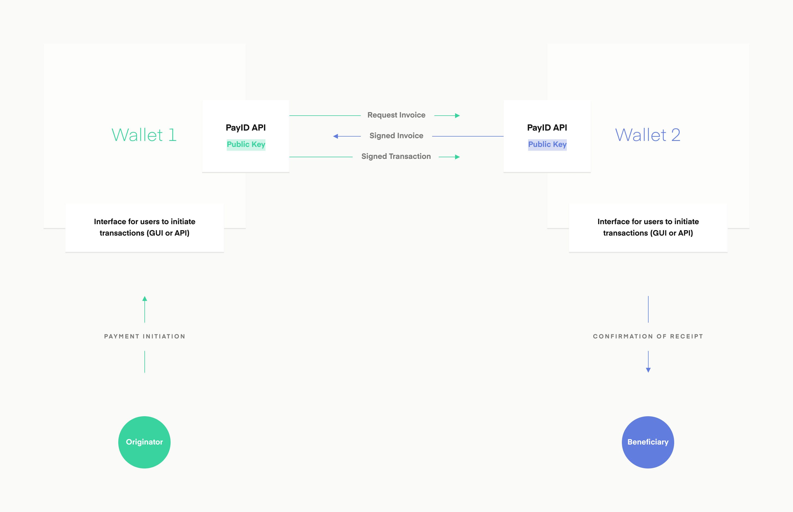
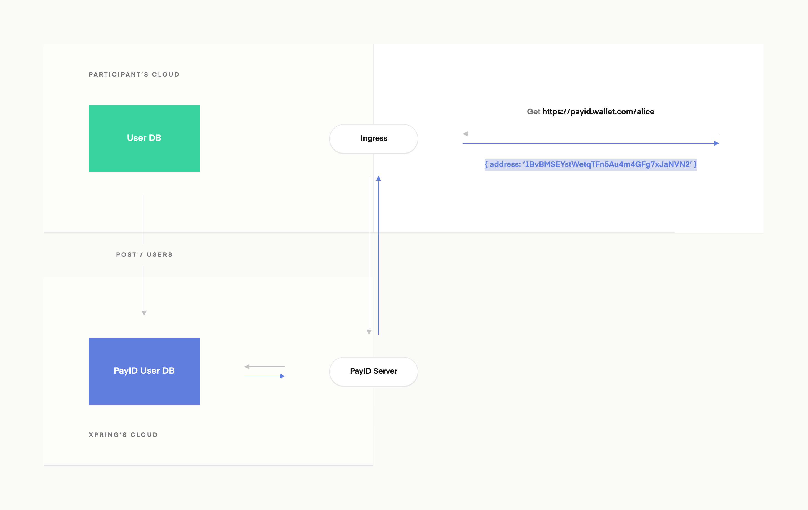

# PayID Specification
#### A protocol for human-readable, Travel Rule-compliant addresses

Each participant in the PayID network reaches one another through a standardized address called a payment pointer (`$user.wallet.com`) which maps to a URL (`https://user.wallet.com/.well-known/pay`). HTTP requests made to this URL resolve to addresses on the underlying payment network. This makes PayID a network-agnostic protocol, capable of sending payments in BTC, ETH, XRP, and even over fiat networks like ACH.

### Web Standards 
PayID uses existing web standards + infrastructure. Each institution maintains sovereignty over their users through making them accessible via their domain name. This empowers each institution to participate in the network through deploying or using a single service. No node management, no consensus, pure utility.

### Currency Agnostic
Acknowledging that the crypto community must work collectively meet the needs of our users and their governments, we designed PayID as a fundamentally neutral protocol. Specifying the currency type in the HTTP header, PayID is capable of returning a user's address information for any network in which they participate.

```
GET /user HTTP/1.1
HOST: wallet.com
```

| Currency | Header | Response |
|:--------|:-------|:---------|
| BTC     | application/btc+json   | { <br>address: '1BvBMSEYstWetAu4m4GFg7xJaNVN2'<br> }      |
| XRP     | application/xrp+json   | { <br> address: 'rLsJ3wsJ57CheYKwH19ES8e7xdnu5XY1bi',<br> destinationTag: '2155' <br> } |
| ACH     | application/ach+json   | { <br> account: '363023456079',<br>routing: '011302838'<br>}  |
| ILP     | application/spsp4+json | { <br> destination_account: 'g.institution.alice',<br> shared_secret: 'Anofne0Slxjv0Aj4malghem'<br>  } |


## Code Examples
```javascript
const axios = require('axios')
const btc = require('bitcoinjs-lib')

async function pay(user, amount) {
  const { address } = await axios.get({
    method: 'GET',
    baseURL: 'https://' + user.slice(1) + '/.well_known/pay'
    headers: { accept: 'application/btc+json' }
  }

  const tx = await new btc.Transaction(address, amount)
}

pay('$alice.institution.com', 0.63)
```

```javascript
// Xpring SDK
const { Wallet } = require("xpring-js");

const wallet = Wallet.generateWalletFromSeed("snRiAJGe3zRwiYDBm1M");
const tx = await wallet.send(0.63, '$alice.institution.com');
```


## Feature Roadmap
### Cryptographic Receipts



Using the web’s existing public key infrastructure, PayID provides cryptographic proof of invoices and transfers. After completing a transaction, the originating party holds a cryptographically signed invoice from the beneficiary and the beneficiary holds a cryptographically signed proof of transfer.

The originator would first query for the payment pointer details:
```
GET https://alice.institution.com/.well-known/pay
Content-type: application/xrp+json
```

Response:
```
{
  destinationDetails: {
    address: ‘r3kmLJN5D28dHuH8vZNUZpMC43pEHpaocV’,
    destinationTag: ‘2445’
  }
  invoiceId: 'I4R561Lm8aApG95bYsOy/SL2vJPNEkY2CmaSxyCa30M=',
}
```

The originator would then submit a transaction to the XRP ledger and respond with the following HTTP POST request, giving both sides cryptographic confirmation of participation in the transaction.

```
POST https://alice.institution.com/.well-known/pay

Body: {
  txId: '6146ccf6a66d994f7c363db875e31ca35581450a4bf6d3be6cc9ac79233a69d0',
  // signature proving tx was sent by this beneficiary
  paymentId: 'jdlI2VeXAcZuMrpM0pc5zdotL27KsuUzQ8TXqzjZPcM='
}
```

### Travel Rule Compliance
As the June 2020 deadline for travel rule compliance nears, through PayID we provide a decentralized web-based solution that maintains user privacy and presents minimal friction for integrating virtual asset service providers (VASPs).

Believing that regulation does not need to impede the crypto user experience, we built travel rule compliance into the backend of PayID. Capitalizing on the need for VASPs to comply with these requirements, PayID actually improves the user experience through human-readable addresses. Users will now be able to send crypto to human-readable addresses, while the travel rule compliance will be abstracted from the end user and handled by participating VASPs.

Anytime a payment is sent to a payment pointer, if both entities are VASPs and must comply with the travel rule, they will exchange the user data in a secure handshake.


## Integration
### Open Source
Participating institutions can use Xpring’s open source reference implementation of the PayID server, which is a simple mapping service. Partners just need to deploy the PayID server with a connection to their existing user database so that it can respond to incoming GET requests.


### Xpring Hosted Service
For partners who want to join the PayID network and minimize their infrastructure burden, Xpring hosts a service that routes payment pointers to addresses for third parties. Only two steps are needed to get up and running on the PayID network:

1. POST usernames and their corresponding addresses to the Xpring service
2. Redirect a subdomain to the Xpring service for incoming GET requests



